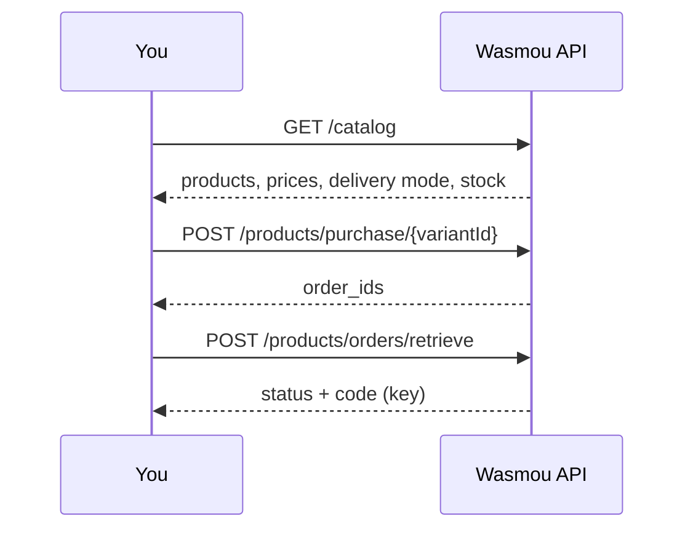

Wasmou is a wholesale platform for digital goods: licence keys, subscriptions, gift codes and game top-ups. The API gives your own shop, bot or reseller panel the same power as the Wasmou app.

<CardGroup cols={2}>
  <Card title="Quickstart" icon="rocket" href="/quickstart">
    Make your first purchase in five minutes.
  </Card>
  <Card title="Full catalog" icon="store" href="/api-reference/catalog/get-catalog">
    Every product, price, delivery mode and stock level in one call.
  </Card>
  <Card title="Delivery modes" icon="bolt" href="/concepts/delivery">
    Instant, key-based and manual: what to expect from each.
  </Card>
  <Card title="Per-client stock" icon="boxes-stacked" href="/concepts/stock">
    Reserve units of a product for your account only.
  </Card>
</CardGroup>

## What you can do

- **Browse** the full catalog with your own prices (`GET /catalog`).
- **Buy** any variant with your wallet balance and receive the code in the response or a follow-up call.
- **Top up games** (Free Fire and PUBG Mobile) after checking the player ID.
- **Track** every order, and read your own stock allocations.

## How it works

<Note>
Everything is sent to `https://api.wasmou.net/api` with your API key in the `X-Api-Key` header. Prices are in Algerian dinars (DZD).
</Note>
