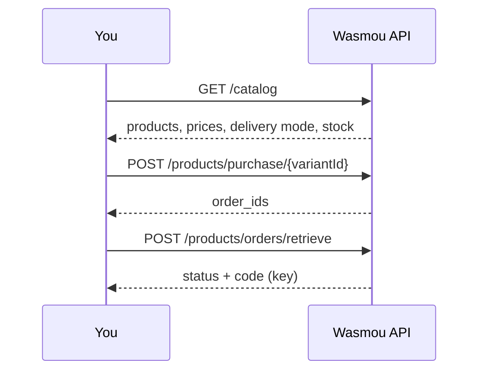

Welcome to the **Wasmou API**, your complete solution for digital services in Algeria. One API key gives your software the same power as the Wasmou app: browse the catalog, buy with your wallet, receive codes, and top up games.

<CardGroup cols={2}>
  <Card title="Quickstart" icon="rocket" href="/quickstart">Your first purchase in five minutes.</Card>
  <Card title="Authentication" icon="key" href="/authentication">API key, IP allow-list and rotation.</Card>
  <Card title="Catalog" icon="store" href="/services/catalog">All products, prices, delivery mode and stock in one call.</Card>
  <Card title="Errors" icon="triangle-exclamation" href="/errors">Status codes, messages and how to recover.</Card>
</CardGroup>

## Base URL

```
https://api.wasmou.net/api
```

<Note>
Every endpoint in this documentation is relative to `/api`. The host used to be `gateway.wasmou.net`; **only the host changed**. Paths, request bodies and responses are the same, so migrating an existing integration means replacing the hostname.
</Note>

## Currency

All prices and balances are in **DZD** (Algerian dinar).

## Available services

| Service | What it does | Guide |
| --- | --- | --- |
| **Account** | Profile, balance and available balance. | [Account & balance](/services/account) |
| **Catalog** | The full product list with your prices and stock. | [Catalog](/services/catalog) |
| **Products** | Licence keys, subscriptions and gift cards: browse, buy, retrieve codes. | [Products](/services/products) |
| **Orders** | One history across every service. | [Orders](/services/orders) |
| **Stock** | Units reserved for your account. | [Stock](/services/stock) |
| **Free Fire** | Diamond top-ups. | [Free Fire](/services/freefire) |
| **PUBG Mobile** | UC top-ups via Gift4Card. | [PUBG Mobile](/services/pubg) |
| **BeIN Sports** | Subscription packages. | [BeIN Sports](/services/beinsports) |

## Authentication

All requests need your API key in a header:

```
X-Api-Key: your_api_key_here
```

## Response format

<CodeGroup>
```json Success
{
  "status": "success",
  "message": "Operation completed successfully",
  "data": { }
}
```
```json Error
{
  "status": "error",
  "message": "Error description",
  "data": null
}
```
</CodeGroup>

## Rate limiting

**60 requests per minute** per API key. Beyond that the API answers `429 Too Many Requests`. See [Errors](/errors#handling-rate-limits) for a back-off strategy.

## Quick start

1. Get your API key from the [Wasmou dashboard](https://myapp.wasmou.net/app/api-access).
2. Check your balance: `GET /api/account`.
3. Browse the [catalog](/services/catalog) and place orders.
4. Track every order with the IDs the API returns.



## Useful links

- [Dashboard](https://myapp.wasmou.net/app) · [API access](https://myapp.wasmou.net/app/api-access) · [Add funds](https://myapp.wasmou.net/deposit)
- [Support on Telegram](https://t.me/wasmou_app)
- [Changelog](/changelog)

*Documentation version 2.0 · October 2026*
